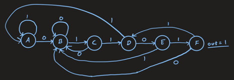
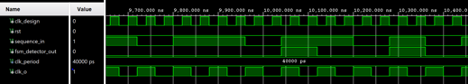

## Sequence Detector

A finite-state machine (FSM) designed in VHDL and implemented on the Zybo Z7 board.

This design is a serial input sequence detector looking for the sequence “01101” with overlapping. 

The basis of the VHDL design for the sequence detector comes from the state diagram implementing a Moore FSM.
The possible states ABCDEF are advanced through while corresponding to the correct input sequence (“01101”). Since overlapping is allowed, rather than always returning to state A upon incorrect input, it will return to the latest state that still corresponds to the correct sequence. 

Possible flow paths for sequence values:

# Simulation

This simulation is the result of a test sequence “101101101011”. The output value is true only 3 cycles after since overlapping is allowed. 
The second valid sequence “101101101011” overlaps with the first “101101101011”. 
For the simulation the clock divider has a value of 1, but to implement the program on the board it must be increased to divide the clock down (by 62500000) to a usable speed for user input. 
